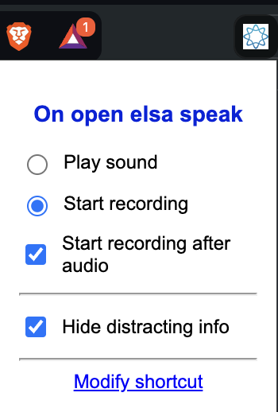
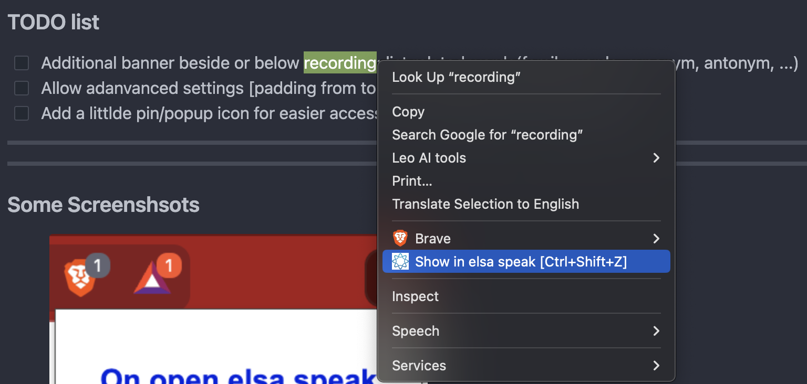
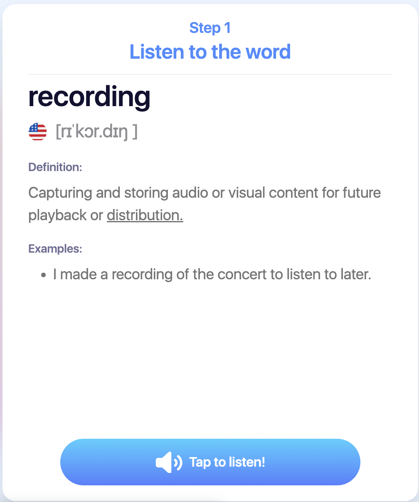
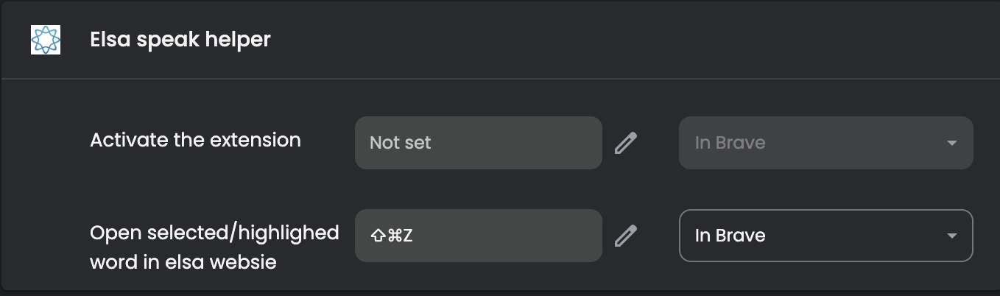

# Simple Elsa speak extension

### Features

- [x] Open selected in elsa website [how to pronunounce](https://elsaspeak.com/en/learn-english/how-to-pronounce/?word=pronunciation)
- [x] Shortcut and open custom short cut from popup (Ctrl+Shift+Z)
- [x] Enable user to choose first action on open dialog(play audio or start recording)
- [x] Add setting to hide distracting banners and dialogs
- [x] Enable start recording when audio completed
- [x] Enable click on word in vocab card container(elsa website)  to open new elsa word
---
---
## Upcoming Features

- [ ] Additional banner beside or below recording: list related words(family words, synonym, antonym, ...)
- [ ] Allow adanvanced settings [padding from top, list banners to choose to hide]
- [ ] Add a littlde pin/popup icon for easier access, then a setting for it at popup too
---
---
## Screenshots

<figure style="text-align: center;">
  
  <figcaption>Quick Settings</figcaption>
</figure>

<figure style="text-align: center;">
  
  <figcaption>Main Usage</figcaption>
</figure>

<figure style="text-align: center;">
  
  <figcaption>Quick Open Reference Word</figcaption>
</figure>

<figure style="text-align: center;">
  
  <figcaption>Shortcut</figcaption>
</figure>

<figure style="text-align: center;">
  
  <figcaption>Demo: How to Use</figcaption>
</figure>

---
---
## Installation Guide

1. Download the zip file from the [release section](https://gitea.thanh0x.com/huythanh0x/elsa_speak_helper_extension/releases).
2. Unzip the file to get the unpacked extension.
3. Follow this [guide](https://www.youtube.com/watch?v=oswjtLwCUqg) to load the unpacked extension into Chrome.